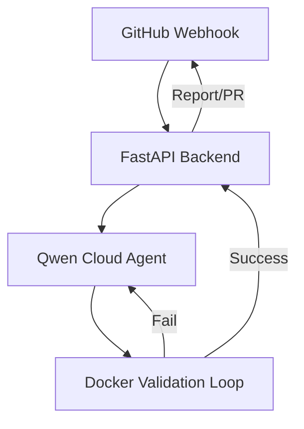

# NoirGuard: Autonomous DevSecOps Auditor & Remediation Agent

NoirGuard is an autonomous agent designed to detect, verify, and remediate security vulnerabilities in real-time, integrating seamlessly into your GitHub development workflow.

## Key Features

- **Automated Auditing:** Monitors repository events via GitHub Webhooks.
- **Isolated Validation:** Uses Dockerized environments to enforce a multi-tiered validation stack (Pylint, Snyk, Pytest).
- **Self-Correction Loop:** Employs a hardened AppSec persona to generate and iteratively refine remediation patches until they pass all security and functional tests.
- **GitHub Integration:** Automatically reports findings and proposes secure pull requests for verified patches.

[](https://sonarcloud.io/summary/new_code?id=RuslanSemchenko_NoirGuard) [](https://sonarcloud.io/summary/new_code?id=RuslanSemchenko_NoirGuard) [](https://sonarcloud.io/summary/new_code?id=RuslanSemchenko_NoirGuard)[](https://sonarcloud.io/summary/new_code?id=RuslanSemchenko_NoirGuard)


## Architecture



## Getting Started

### Prerequisites

- Python 3.14+
- Docker
- Qwen Cloud API Key
- GitHub Personal Access Token

### Installation

1. Clone the repository:
   ```bash
   git clone https://github.com/RuslanSemchenko/NoirGuard.git
   cd NoirGuard
   ```

2. Install dependencies:
   ```bash
   pip install -r requirements.txt
   ```

3. Set up environment variables:
   ```bash
   export QWEN_API_KEY="your-qwen-key"
   export GITHUB_TOKEN="your-github-token"
   ```

4. Run the application:
   ```bash
   uvicorn app.main:app --reload
   ```

## License

This project is licensed under the MIT License. See the [LICENSE](LICENSE) file for details.
