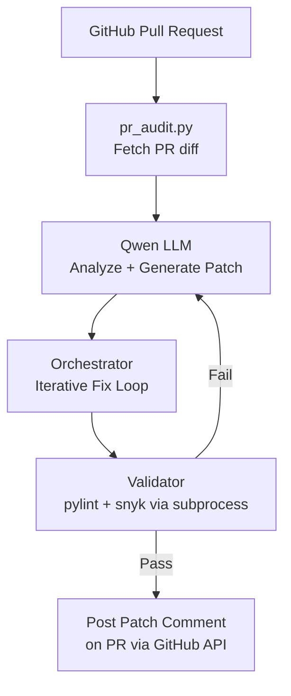

# NoirGuard: Autonomous DevSecOps Auditor & Remediation Agent

NoirGuard is an autonomous agent that detects, verifies, and remediates security vulnerabilities in Python code. It integrates with GitHub PRs — upon receiving a pull request, it analyzes the diff with Qwen API, validates fixes with `pylint` and `snyk` via subprocess, and posts a remediated patch as a PR comment.

## Key Features

- **Automated PR Auditing:** Fetches PR diffs, analyzes for vulnerabilities via Qwen (LLM), and generates patches.
- **Host-Based Validation:** No Docker — runs `pylint --errors-only` and `snyk code test` directly via subprocess.
- **Self-Correction Loop:** Iteratively refines patches until they pass all checks (up to 3 attempts).
- **GitHub Integration:** Automatically posts remediation comments on pull requests using the GitHub API.
- **Custom Qwen Endpoint:** Supports any OpenAI-compatible API via `QWEN_BASE_URL`.

## Architecture



### Component Flow

1. **pr_audit.py** — Fetches a PR diff from GitHub, sends it to the orchestrator.
2. **app/agent.py** — Qwen client that analyzes code and generates fixes using a security-hardened system prompt.
3. **app/orchestrator.py** — Orchestrates the remediation loop: extracts code from markdown, passes to validator, retries on failure.
4. **app/validator.py** — Runs `pylint --errors-only` then `snyk code test` via subprocess on a temp file. No Docker required.

## Getting Started

### Prerequisites

- Python 3.14+
- Qwen API Key (or any OpenAI-compatible endpoint)
- GitHub Personal Access Token (permissions: `repo`, `pull requests`)
- (Optional) Snyk CLI + Token — `npm install -g snyk`

### Quick Setup

**Windows:**
```
setup.bat
```
**Linux/macOS:**
```
chmod +x setup.sh && ./setup.sh
```

The setup script will:
1. Find Python and create a virtual environment
2. Install dependencies
3. Prompt for API keys (or load from `.env`)
4. Show a menu to run audit tests

### Manual Setup

```bash
git clone https://github.com/RuslanSemchenko/NoirGuard.git
cd NoirGuard
python -m venv .venv
.venv\Scripts\activate      # Windows
source .venv/bin/activate   # Linux/macOS
pip install -r requirements.txt pylint

export QWEN_API_KEY="your-key"
export QWEN_BASE_URL="https://dashscope.aliyuncs.com/compatible-mode/v1"
export GITHUB_TOKEN="your-token"
```

### Usage

**Quick audit test (static test file):**
```
python run_audit.py
```

**Audit a real GitHub PR:**
```
python pr_audit.py owner/repo PR_NUMBER
```
Example: `python pr_audit.py RuslanSemchenko/NoirGuard 2`

**Full E2E test (creates a vulnerable PR + audits it):**
```
test_pr.bat    # Windows only
```

**Web server (FastAPI):**
```
uvicorn app.main:app --reload
```

## Environment Variables

| Variable | Required | Description |
|----------|----------|-------------|
| `QWEN_API_KEY` | Yes | Qwen DashScope API key |
| `QWEN_BASE_URL` | No | Custom API endpoint (default: DashScope) |
| `GITHUB_TOKEN` | Yes | GitHub PAT with repo & PR scope |
| `SNYK_TOKEN` | No | Snyk token (disables Snyk if not set) |

## Security Notes

- Your API keys are stored in environment variables only — never hardcoded in committed files.
- Use `setup_private.bat` / `setup_private.sh` (already in `.gitignore`) for local key storage.
- To reset keys, delete `.env` or unset env vars and re-run setup.

## License

MIT
