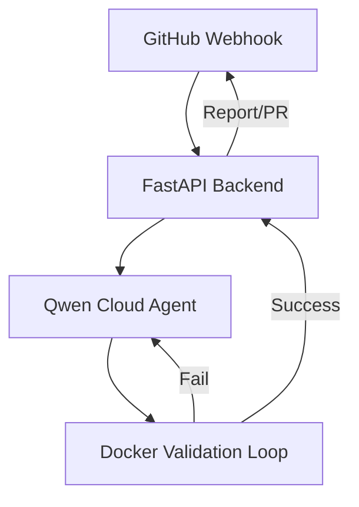

# NoirGuard Architecture

```mermaid
graph TD
    GH[GitHub Webhook] --> API[FastAPI Backend]
    API --> Agent[Qwen Cloud Agent]
    Agent --> Validator[Docker Validation Loop]
    Validator -->|Success| API
    Validator -->|Fail| Agent
    API -->|Report/PR| GH
```
